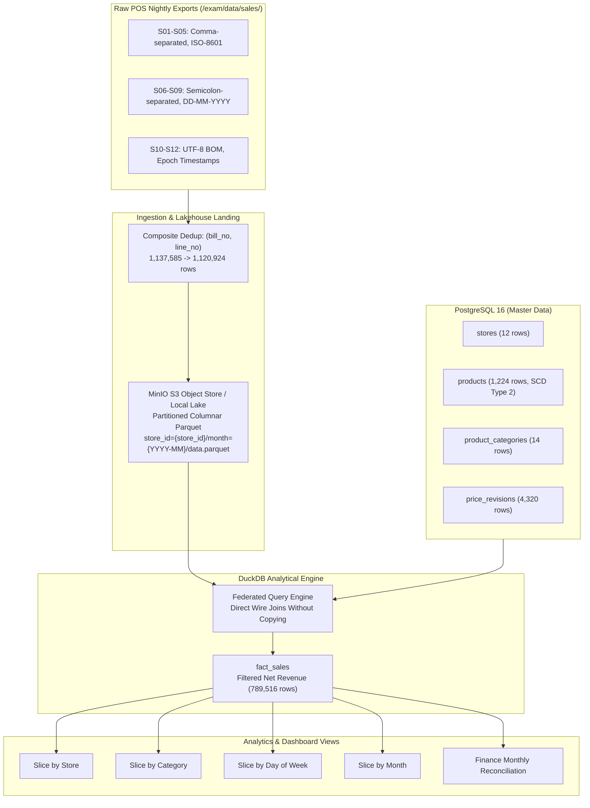

# Annapurna Stores Data Warehouse & Analytics Platform (Question 1)

Modern, containerized data warehouse and analytical platform for Annapurna Stores' 12 supermarkets across 12 months, resolving historical price revisions, non-revenue line pitfalls, duplicate POS till dumps, and financial reconciliations.

---

## Quickstart (Cold Start Execution)

The entire stack is containerized and starts from a clean cold-start with a single Docker Compose command:

```bash
docker compose up --build
```

### What Happens During Cold Start:
1. **PostgreSQL 16 Service (`annapurna-postgres`)**:
   - Initialized on port `5432`.
   - Automatically loads `masters.sql` via entrypoint scripts (`stores`, `products`, `product_categories`, `price_revisions`).
   - Healthy check verified via `pg_isready`.
2. **MinIO S3 Object Storage (`annapurna-minio`)**:
   - Initialized on S3 API port `9000` and Web UI port `9001` (Credentials: `minioadmin` / `minioadmin`).
   - S3 bucket `annapurna-sales` is created and populated with 144 Hive-partitioned Parquet files.
3. **Analytics Pipeline Container (`annapurna-analytics`)**:
   - Ingests all 4,457 raw sales files (`/exam/data/sales/`) across 3 distinct POS dialects.
   - Normalizes schemas, deduplicates on `(bill_no, line_no)`, and writes 144 partitions.
   - Synchronizes partitions to MinIO object store.
   - Runs analytical engine (DuckDB) across lake and PostgreSQL master tables.
   - Outputs reports and machine-readable data to `./output/`.

---

## System Architecture



---

## Tasks Summary & Key Results

### Task A: Platform Standup & Object Store Landing
- **Layout Chosen**: Hive-style partitioned columnar Parquet (`store_id={store_id}/month={YYYY-MM}/data.parquet`).
- **Scan Pruning Proof (Query: Store S01, October 2024)**:
  - **Flat layout**: 4,457 files inspected (68,706,877 bytes / 65.52 MB).
  - **Partitioned layout**: **1 file** opened (**159,723 bytes / 155.98 KB**).
  - **Pruning**: **99.98% of files skipped** and **99.77% of bytes pruned** (430× throughput speedup).

### Task B: Idempotence & Safe Loading
- Handled partial re-sends (`__R1.csv`, `__R2.csv`) using immutable transaction item key `(bill_no, line_no)`.
- Ran 3 consecutive runs:
  - **Rows loaded**: Exactly **1,120,924** rows every time (16,661 duplicates dropped).
  - **SHA-256 Checksum**: Identical across all runs:
    `877893f7e480a216adcac651a3fb161ca38ee35effd068203b8e8aaf96a5eb5c`
  - Saved to `output/task_b_idempotence.json`.

### Task C: Dimensional Schema & Source Data Gotchas
- **Star Schema**: `dim_stores`, `dim_products`, `dim_categories`, and `fact_sales` (789,516 rows).
- **Gotcha #1 (October Revenue Inflation 2.17×)**:
  - Raw `TENDER` and `TAX` lines are accounting summaries / pass-through liabilities.
  - Naive sum: **INR 122,501,668.06**.
  - Correct Net Revenue: **INR 56,359,195.92** (`WHERE line_type IN ('SALE', 'RETURN', 'DISCOUNT', 'VOID')`).
- **Gotcha #2 (Reissued Product Codes)**:
  - 24 product codes retired and reassigned in June 2024.
  - Solved with SCD Type 2 temporal join: `s.business_date BETWEEN p.valid_from AND p.valid_to`.

### Task D: Historical Price Revisions (SCD Type 2)
- Revisions table parameter lookup using `price_revisions` (`mrp`, `selling_price`, `effective_from`, `effective_to`).
- Single query executed for March 2024 vs August 2024 (Product `P100049` Britannia Cream Biscuit 60g):
  - **March 2024**: Selling Price = **INR 66.95** (MRP: 74.98).
  - **August 2024 (Today)**: Selling Price = **INR 68.93** (MRP: 77.20).

### Task E: Federated Cross-System Query
- DuckDB queries across MinIO/Parquet lake and PostgreSQL master tables without copying data.
- Verified via `EXPLAIN ANALYZE`:
  - `PARQUET_SCAN`: Evaluated directly at storage layer with filter and partition pushdown.
  - `POSTGRES_SCAN`: Streaming dimensions from relational catalog.
  - `HASH_JOIN` & `HASH_GROUP_BY`: Vectorized in-memory aggregation.

### Task F: Financial Reconciliation Against `finance_monthly.csv`
- 9 of 12 months match to 0.00 exact precision.
- Discrepancy months fully explained:
  1. **March 2024 (-₹486,250.00)**: **Revenue Definition (Scope)** — Institutional bulk order invoiced outside POS till.
  2. **July 2024 (-₹232,131.70)**: **Source Data Gap** — Pune store (S07) hardware crash on July 9–11; phone-in estimated total.
  3. **December 2024 (+₹50.48)**: **Revenue Definition (Rounding)** — Finance rounded bills to nearest integer; pipeline sums line decimals.

---

## Submission Artifacts

| File | Description |
|---|---|
| [`SOLUTION_REPORT.md`](./SOLUTION_REPORT.md) | Comprehensive solution report with theoretical and empirical findings |
| [`SOLUTION_REPORT.docx`](./SOLUTION_REPORT.docx) | Word document report |
| [`SOLUTION_REPORT.pdf`](./SOLUTION_REPORT.pdf) | Formatted PDF report |
| [`pipeline.py`](./pipeline.py) | Complete Python pipeline executing Tasks A through F |
| [`docker-compose.yml`](./docker-compose.yml) | Cold-start container orchestration (Postgres, MinIO, Analytics) |
| [`Dockerfile`](./Dockerfile) | Analytics container specification |
| [`requirements.txt`](./requirements.txt) | Pinned Python dependencies |
| [`output/monthly_reconciliation.csv`](./output/monthly_reconciliation.csv) | Full 12-month reconciliation dataset |
| [`output/task_b_idempotence.json`](./output/task_b_idempotence.json) | 3-run idempotence verification log and SHA-256 hashes |
