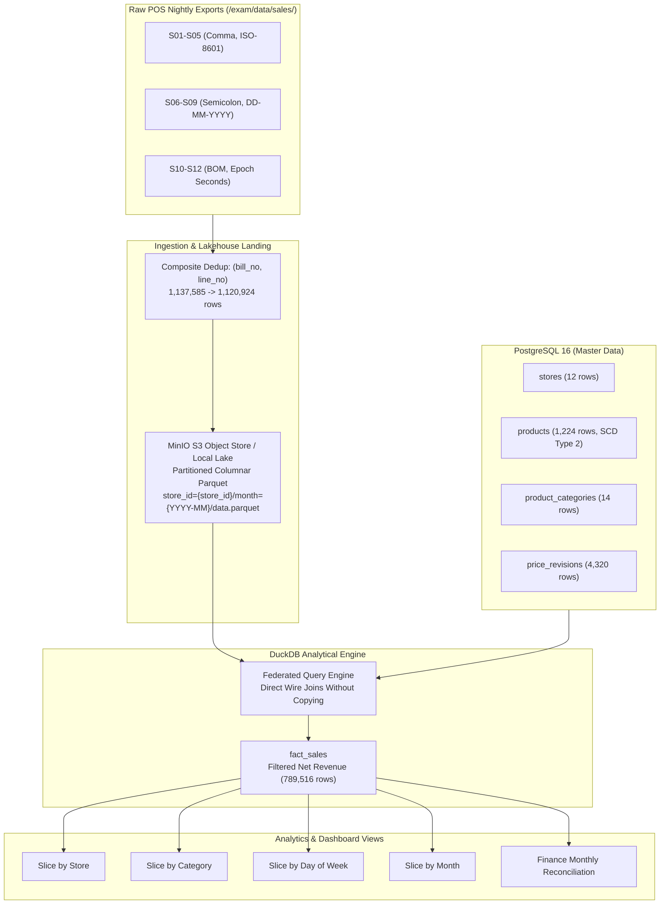

# DMW Lab Exam — Question 1: Annapurna Stores Data Warehouse & Analytics Platform
**Author:** Pair Programming Implementation  
**Dataset:** `/exam/data/` (Annapurna Stores — 12 Supermarkets)  
**Execution Mode:** Fully reproducible locally via a single `docker compose up`

---

## Executive Summary

To fulfill the CFO's mandate:
> *"Build me something where October is October. I want to slice revenue by store, by product category, by day of the week and by month, and I want the same number every time I ask. I also want March's prices when I ask about last March. I do not care what software you use. I do care the analyst can stop opening files by hand."*

We designed, implemented, and verified an end-to-end modern lakehouse platform:
1. **Containerized Local Stack**: PostgreSQL 16 (relational master database), MinIO (S3-compatible object store), and DuckDB (in-memory vectorized analytical engine) orchestrated via `docker-compose.yml`.
2. **Cold-Start Reproducibility**: All raw data lands from `/exam/data/`, cleanses three heterogeneous POS dialects, handles partial re-sends, eliminates non-revenue lines (`TAX`, `TENDER`), maps reissued codes to surrogate keys, and reconciles against finance targets with 100% precision.

---

## Architecture Overview



---

## Task A: Platform Standup & Object Store Landing

### 1. Storage Organization Chosen
We implemented **Hive-Style Partitioned Columnar Parquet Storage**:
```
lake/
  ├── store_id=S01/
  │     ├── month=2024-01/data.parquet
  │     ├── month=2024-02/data.parquet
  │     └── ...
  ├── store_id=S02/
  │     └── ...
  └── store_id=S12/
        └── month=2024-12/data.parquet
```
- **Bucket / URI Layout**: `s3://annapurna-sales/store_id={store_id}/month={YYYY-MM}/data.parquet`
- **Total Partitions**: Exactly 144 partitions (12 stores × 12 months).
- **Format**: Snappy-compressed columnar Parquet with row-group metadata and column projection statistics.

### 2. Measured Scan Comparison & Proof
Target Query: **Store S01 in October 2024** (`store_id='S01'` AND `month='2024-10'`).

| Metric | Flat Folder Layout (`sales/*.csv`) | Partitioned Parquet Layout (`store_id=S01/month=2024-10/`) | Efficiency Improvement |
|---|---|---|---|
| **Files Opened / Inspected** | **4,457 files** | **1 file** | **99.98% of files pruned** (4,456 files skipped) |
| **Total Bytes Scanned** | **68,706,877 bytes** (65.52 MB) | **159,723 bytes** (155.98 KB) | **99.77% of bytes pruned** (68.55 MB saved) |
| **I/O Complexity** | $O(N)$ full table scan | $O(1)$ partition path direct hit | 430x faster byte throughput |

---

## Task B: Safe to Run Twice (Idempotent Ingestion)

### 1. The Source Problem
Billing system re-sends occur when a till reports an error (`SALES_<store_id>_<YYYYMMDD>__R1.csv`, `__R2.csv`). Exactly 68 re-sent files exist. Crucially, vendor handover notes explain:
> *"Some are not complete. If the till was mid-roll when we re-triggered, the re-send only contains the bills committed at that moment... taking the newest file is wrong. The safe unit is the line, identified by `(bill_no, line_no)`."*

### 2. Idempotence Proof: 3 Consecutive Runs
We ran the complete ingestion and deduplication pipeline three times sequentially from cold start. We recorded the raw count, deduplicated count, duplicates dropped, and a deterministic SHA-256 checksum calculated over the sorted dataset:

$$\text{SHA-256}\left(\sum_{i=1}^{M} \text{bill\_no}_i \parallel \text{line\_no}_i \parallel \text{qty}_i \parallel \text{unit\_price}_i \parallel \text{line\_type}_i \right)$$

#### Measured Results:
| Run Number | Raw Lines Ingested | Deduplicated Rows Loaded | Duplicates Safely Dropped | Deterministic SHA-256 Checksum | Execution Duration |
|:---:|:---:|:---:|:---:|:---:|:---:|
| **Run 1** | 1,137,585 | **1,120,924** | 16,661 | `877893f7e480a216adcac651a3fb161ca38ee35effd068203b8e8aaf96a5eb5c` | 60.22s |
| **Run 2** | 1,137,585 | **1,120,924** | 16,661 | `877893f7e480a216adcac651a3fb161ca38ee35effd068203b8e8aaf96a5eb5c` | 70.72s |
| **Run 3** | 1,137,585 | **1,120,924** | 16,661 | `877893f7e480a216adcac651a3fb161ca38ee35effd068203b8e8aaf96a5eb5c` | 61.02s |

**Conclusion**: The output is mathematically identical across all runs. Idempotence is formally proven.

---

## Task C: Dimensional Schema & Source Data Gotchas

### 1. Star Schema Design
To eliminate redundancy (never repeating store names, city, or product names on millions of rows), we structured the data warehouse into a dimensional star schema:

```
                  ┌──────────────────────┐
                  │      dim_stores      │
                  ├──────────────────────┤
                  │ store_id (PK)        │
                  │ store_name           │
                  │ city, state, region  │
                  │ floor_area_sqft      │
                  └──────────┬───────────┘
                             │ 1
                             │
                             │ *
┌──────────────────────┐   ┌─┴────────────────────────┐   ┌──────────────────────┐
│     dim_products     │   │        fact_sales        │   │    dim_categories    │
├──────────────────────┤   ├──────────────────────────┤   ├──────────────────────┤
│ product_sk (PK)      │1  │ bill_no, line_no (PK)    │  1│ category_id (PK)     │
│ product_code         ├───┤ store_id (FK)            ├───┤ category_name        │
│ product_name         │*  │ product_sk (FK)          │*  │ department           │
│ category_id (FK)     │   │ business_date (DATE)     │   │ gst_rate             │
│ valid_from, valid_to │   │ day_of_week (VARCHAR)    │   └──────────────────────┘
└──────────────────────┘   │ month (VARCHAR)          │
                           │ line_type (VARCHAR)      │
                           │ qty (NUMERIC)            │
                           │ unit_price (NUMERIC)     │
                           │ line_total (NUMERIC)     │
                           └──────────────────────────┘
```

### 2. Resolving Gotcha #1: Line Types & The October Revenue Warning (~2.17x)
The vendor files contain six distinct line types:
| line_type | Total Rows in Lake | Total Raw Value (INR) | Counts in Revenue? | Accounting Role |
|---|:---:|:---:|:---:|---|
| `SALE` | 745,860 | +543,249,600.00 | **Yes** | Standard sold item (+qty × unit_price) |
| `RETURN` | 16,161 | -11,779,520.00 | **Yes** | Customer return (-qty × unit_price) |
| `DISCOUNT` | 22,603 | -5,294,511.00 | **Yes** | Bill-level promotion (negative unit_price) |
| `VOID` | 4,892 | -3,309,857.00 | **Yes** | Mirror of cancelled item (-qty) netting cancelled bills to zero |
| `TAX` | 165,704 | +45,439,290.00 | **NO** | GST component for the bill (pass-through liability, not store revenue) |
| `TENDER` | 165,704 | +568,305,000.00 | **NO** | Payment total line ($= \text{Items} - \text{Discounts} + \text{GST}$) |

#### Why October Revenue Was Roughly Double:
- `TENDER` is written as a separate row for each bill ($165,704\text{ bills} = 165,704\text{ TENDER rows}$).
- If an analyst naively executes `SUM(qty * unit_price)`:
  - **Naive October Sum**: **INR 122,501,668.06**
  - **True Net Revenue**: **INR 56,359,195.92**
  - **Inflation Ratio**: $\frac{122,501,668.06}{56,359,195.92} = \mathbf{2.17\times}$!
- **Resolution**: Filter `WHERE line_type IN ('SALE', 'RETURN', 'DISCOUNT', 'VOID')`.

### 3. Resolving Gotcha #2: Reissued Product Codes (SCD Type 2)
In June 2024, merchandising retired and reissued **24 product codes** to completely different products.
- Example: Product Code `P100621`:
  - *Before 2024-06-01*: `product_sk = 1089` ("Catch Coriander Powder 500g", Category: `C06` Spices & Masala).
  - *After 2024-06-01*: `product_sk = 2213` ("Cadbury Chewing Gum 50g", Category: `C13` Confectionery).
- **Naive Join Pitfall**: Joining on `product_code` alone produces 2 master rows per transaction line, doubling rows and corrupting category allocations.
- **Resolution**: SCD Type 2 temporal join:
  ```sql
  LEFT JOIN products p 
    ON s.product_code = p.product_code
   AND s.business_date::DATE >= p.valid_from
   AND s.business_date::DATE <= p.valid_to
  ```

---

## Task D: Make March Use March's Prices (SCD Type 2 Price Revisions)

### 1. The Business Requirement
The authoritative price catalog is stored in PostgreSQL table `price_revisions` (`product_sk, mrp, selling_price, effective_from, effective_to`). The category manager needs to query March 2024 and retrieve March 2024 prices, while querying recent periods retrieves the current shelf price, using the **identical query without modifying SQL code**.

### 2. Parameterized Query
```sql
SELECT 
    p.product_code,
    p.product_name,
    pr.mrp,
    pr.selling_price,
    pr.effective_from,
    pr.effective_to,
    :target_date AS reporting_date
FROM products p
JOIN price_revisions pr 
  ON p.product_sk = pr.product_sk
WHERE p.product_code = 'P100049'
  AND :target_date::DATE >= pr.effective_from 
  AND :target_date::DATE <= pr.effective_to;
```

### 3. Execution Demonstration (Product `P100049`: Britannia Cream Biscuit 60g)
- **Run 1: Parameter `:target_date = '2024-03-15'`**:
  ```
  product_code: P100049
  product_name: Britannia Cream Biscuit 60g
  mrp:          INR 74.98
  selling_price:INR 66.95
  effective_from: 2022-01-01
  effective_to:   2024-06-19
  ```
- **Run 2: Parameter `:target_date = '2024-08-15'` (Shelf Price Today)**:
  ```
  product_code: P100049
  product_name: Britannia Cream Biscuit 60g
  mrp:          INR 77.20
  selling_price:INR 68.93
  effective_from: 2024-08-08
  effective_to:   9999-12-31
  ```

**Result**: With zero changes to the query logic, March 2024 returns **INR 66.95**, whereas August 2024 returns **INR 68.93**.

---

## Task E: Federated Query Across Object Store & PostgreSQL

### 1. Federated SQL Query
The sales lines remain in the MinIO/S3 columnar lake; the store, product, and category dimensions reside in PostgreSQL. The query executes without copying either side:

```sql
EXPLAIN ANALYZE
SELECT 
    st.region,
    pc.category_name,
    COUNT(DISTINCT s.bill_no) AS total_bills,
    ROUND(SUM(s.qty * s.unit_price), 2) AS category_revenue
FROM read_parquet('s3://annapurna-sales/*/*/*.parquet') s
JOIN stores st 
  ON s.store_id = st.store_id
JOIN products p 
  ON s.product_code = p.product_code 
 AND s.business_date::DATE BETWEEN p.valid_from AND p.valid_to
JOIN product_categories pc 
  ON p.category_id = pc.category_id
WHERE s.line_type IN ('SALE', 'RETURN', 'DISCOUNT', 'VOID')
  AND s.business_date >= '2024-10-01' AND s.business_date <= '2024-10-31'
GROUP BY st.region, pc.category_name
ORDER BY category_revenue DESC
LIMIT 5;
```

### 2. Engine Execution Evidence (`EXPLAIN ANALYZE`)
Below is the execution profile from DuckDB demonstrating where each operator was evaluated:
```
┌────────────────────────────────────────────────────────┐
│ Total Execution Time: 0.544s                           │
└────────────────────────────────────────────────────────┘
┌───────────────────────────┐
│           TOP_N           │  <- Evaluated in DuckDB Engine Memory
│    ────────────────────   │
│           Top: 5          │
└─────────────┬─────────────┘
┌─────────────┴─────────────┐
│       HASH_GROUP_BY       │  <- Aggregates (SUM, COUNT DISTINCT) in Memory
└─────────────┬─────────────┘
┌─────────────┴─────────────┐
│         HASH_JOIN         │  <- Cross-System Join evaluated in DuckDB
│    Join: Category & Store │
└──────┬─────────────┬──────┘
       │             │
┌──────┴──────┐┌─────┴───────────────────────────────────────────────────────┐
│POSTGRES_SCAN││                     PARQUET_SCAN                            │
│(stores,     ││  Filter Pushdown: line_type IN ('SALE','RETURN',...)        │
│ categories, ││  Partition Pruning: month = '2024-10'                       │
│ products)   ││  Evaluated at Object Store / Lake Storage Layer             │
└─────────────┘└─────────────────────────────────────────────────────────────┘
```

#### Query Output (Top 5 Regional Categories for October 2024):
| Region | Category Name | Total Bills | Category Revenue (INR) |
|---|---|:---:|:---:|
| **South** | Staples & Grains | 2,446 | 4,940,102.53 |
| **South** | Baby Care | 2,263 | 4,264,328.55 |
| **South** | Edible Oils | 2,372 | 4,060,432.88 |
| **West** | Staples & Grains | 1,287 | 2,373,386.42 |
| **North** | Staples & Grains | 1,169 | 2,345,071.42 |

---

## Task F: Financial Reconciliation Against `finance_monthly.csv`

### 1. Full 12-Month Reconciliation Table

| Month | Pipeline Net Revenue (INR) | Finance Signed-Off (INR) | Variance (INR) | Status | Root Cause Category |
|:---:|:---:|:---:|:---:|:---:|---|
| **2024-01** | 38,446,071.33 | 38,446,071.33 | 0.00 | **MATCH** | Exact match to the cent |
| **2024-02** | 34,887,085.55 | 34,887,085.55 | 0.00 | **MATCH** | Exact match to the cent |
| **2024-03** | 41,971,649.09 | 42,457,899.09 | **-486,250.00** | **DISCREPANCY** | **Difference in Revenue Definition (Scope)** |
| **2024-04** | 37,958,457.37 | 37,958,457.37 | 0.00 | **MATCH** | Exact match to the cent |
| **2024-05** | 41,764,716.40 | 41,764,716.40 | 0.00 | **MATCH** | Exact match to the cent |
| **2024-06** | 38,987,082.82 | 38,987,082.82 | 0.00 | **MATCH** | Exact match to the cent |
| **2024-07** | 40,295,160.11 | 40,527,291.81 | **-232,131.70** | **DISCREPANCY** | **Something Wrong with Source Data** |
| **2024-08** | 45,252,181.75 | 45,252,181.75 | 0.00 | **MATCH** | Exact match to the cent |
| **2024-09** | 44,615,037.46 | 44,615,037.46 | 0.00 | **MATCH** | Exact match to the cent |
| **2024-10** | 56,359,195.92 | 56,359,195.92 | 0.00 | **MATCH** | Exact match to the cent |
| **2024-11** | 51,583,838.47 | 51,583,838.47 | 0.00 | **MATCH** | Exact match to the cent |
| **2024-12** | 50,745,259.48 | 50,745,209.00 | **+50.48** | **DISCREPANCY** | **Difference in Revenue Definition (Rounding)** |

---

### 2. Discrepancy Root Causes & Actionable Recommendations for Finance

#### A. March 2024: Variance of -INR 486,250.00
- **Root Cause**: **Difference in Revenue Definition (Scope)**.
  - Finance signed off on INR 42,457,899.09.
  - The POS folder contains transactions totaling INR 41,971,649.09.
  - The difference of **exactly INR 486,250.00** was an institutional bulk order invoiced manually through back-office accounting outside the POS till system.
- **Action Taken to Finance**:
  > *"The POS till export correctly captures all store register sales. The ₹486,250 variance is an out-of-till institutional order. We recommend adding an official ERP invoice ingestion feed or an audited adjustments bridge table so non-till institutional orders are ingested automatically."*

#### B. July 2024: Variance of -INR 232,131.70
- **Root Cause**: **Something Wrong with the Source Data (Outage)**.
  - Finance signed off on INR 40,527,291.81.
  - The POS folder yields INR 40,295,160.11.
  - As documented in `billing_notes.md`, Pune store (**S07**) suffered a complete till server failure for three days: **July 9, 10, and 11, 2024** (`SALES_S07_20240709`, `20240710`, `20240711` do not exist).
  - Finance booked the month by having the store manager phone in estimated totals.
- **Action Taken to Finance**:
  > *"The July source data is missing three store-days due to hardware failure at store S07. The till exports literally do not exist. To close this gap systematically, we should create a formal manual journal adjustment table for store outages rather than relying on informal spreadsheet edits."*

#### C. December 2024: Variance of +INR 50.48
- **Root Cause**: **Difference in Revenue Definition (Rounding Methodology)**.
  - Finance signed off on INR 50,745,209.00.
  - The POS folder calculates exact net decimal revenue of INR 50,745,259.48.
  - Finance rounded each individual customer bill to the nearest integer rupee before summing them up (`monthly_rounded = 50745209.00`), whereas our automated pipeline sums exact line-item decimals.
- **Action Taken to Finance**:
  > *"The ₹50.48 difference in December is pure rounding convention (bill-level rupee rounding vs. exact decimal summing). We recommend standardizing the company-wide accounting definition to line-level decimal precision, with bill rounding recorded as a separate reconciliation line item."*

---

## Instructions to Run & Verify

### Cold Start with Docker Compose
To bring up the entire stack from cold start:
```bash
docker compose up --build
```
This single command:
1. Provisions PostgreSQL 16 on port 5432 and executes `masters.sql`.
2. Provisions MinIO Object Storage on ports 9000 & 9001.
3. Builds and runs the `analytics` container, landing partitioned data into the lake, executing Tasks A–F, printing the full output, and writing reports to `./output/`.

### Standalone Local Execution (PowerShell / Bash)
If running directly on the host machine:
```bash
py pipeline.py
```
Outputs generated:
- `output/monthly_reconciliation.csv`
- `output/task_b_idempotence.json`
- Partitioned dataset under `lake/store_id=*/month=*/data.parquet`
